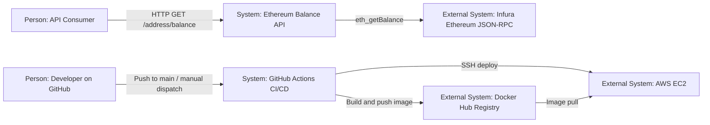
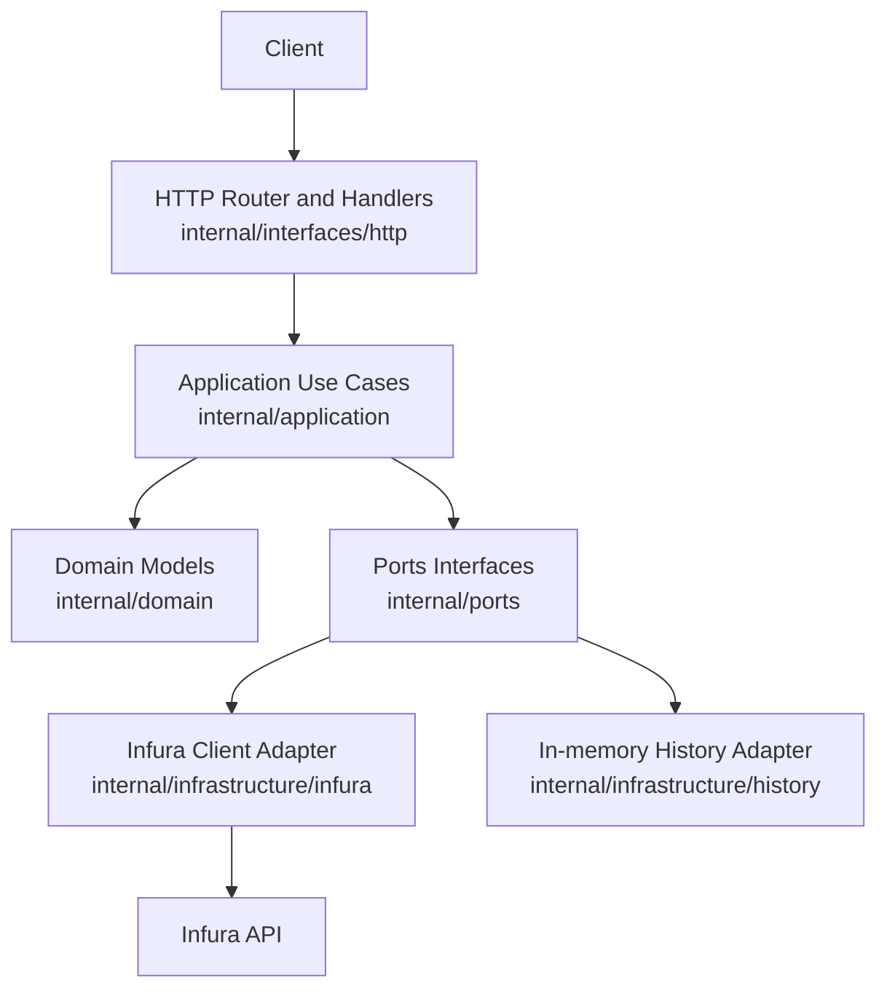

# Ethereum Balance API (Go + DDD)

Small Go API that reads Ethereum account balances from Infura and returns ETH values.

## Features

- `GET /address/balance/{ethAddress}`: returns current balance for an Ethereum address
- `GET /requests/history`: returns recent balance request history (demo feature)
- DDD-inspired structure (`domain`, `application`, `ports`, `infrastructure`, `interfaces`)
- Dockerized service
- Terraform for AWS EC2 deployment
- GitHub Actions CI/CD pipeline

## Architecture (C4 - simple)

### Level 1 - System Context



### Level 2 - Container View (inside this project)



## API examples

### Get balance

```bash
curl "http://localhost:8080/address/balance/0xc94770007dda54cF92009BFF0dE90c06F603a09f"
```

Response:

```json
{
  "balance": "0.0001365"
}
```

### Get request history

```bash
curl "http://localhost:8080/requests/history"
```

Optional limit:

```bash
curl "http://localhost:8080/requests/history?limit=10"
```

## Local development

### Prerequisites

- Go 1.22+
- Docker (optional for container run)

### Run locally

1. Copy env file:

```bash
cp .env.example .env
```

2. Edit `.env` and set your Infura URL:

```bash
INFURA_URL=https://mainnet.infura.io/v3/<your-project-id>
```

3. Run:

```bash
set -a && source .env && set +a
go run ./cmd/api
```

### Run tests

```bash
go test ./...
```

## Docker

Build:

```bash
docker build -t go-api:local .
```

Run:

```bash
docker run --rm -p 8080:8080 \
  -e PORT=8080 \
  -e INFURA_URL="https://mainnet.infura.io/v3/<your-project-id>" \
  go-api:local
```

## Terraform deployment (AWS EC2)

Files are in `terraform/`.

What Terraform provisions:
- VPC + public subnet + internet gateway + route table
- Security group (SSH and API port ingress)
- EC2 key pair from your local public key
- One EC2 instance running Dockerized API via `user_data`

1. Create vars file:

```bash
cd terraform
cp terraform.tfvars.example terraform.tfvars
```

2. Fill `terraform.tfvars`:

- `ssh_allowed_cidr`: your public IP in CIDR format
- `api_allowed_cidr`: CIDR allowed to call API (default `0.0.0.0/0`)
- `public_key_path`: path to your SSH public key
- `docker_image`: Docker Hub image/tag
- `infura_url`: Infura endpoint
- `port`: API container port (default `8080`)

3. Deploy:

```bash
terraform init
terraform plan
terraform apply
```

4. Use output:

```bash
terraform output api_base_url
```

5. Destroy (when done):

```bash
terraform destroy
```

Notes:
- Keep `terraform.tfvars` out of git (already ignored).
- Restrict `ssh_allowed_cidr` to your exact IP (`x.x.x.x/32`) for safer access.
- For production-like setups, prefer ALB + ASG + HTTPS (ACM) instead of a single public EC2.

## GitHub Actions CI/CD

Workflow: `.github/workflows/ci-cd.yml`

Triggers:
- Push to `main`
- Manual run (`workflow_dispatch`)

Pipeline stages:
1. **test-build-push**
   - Setup Go from `go.mod`
   - Run `go test ./...`
   - Build image with tags: short SHA + `latest`
   - Push both tags to Docker Hub
2. **deploy**
   - Connect to EC2 over SSH
   - Pull SHA-tagged image
   - Replace running container (`eth-balance-api`)
   - Start with `--restart unless-stopped`, `PORT`, and `INFURA_URL`

Configure these GitHub secrets:
- `DOCKERHUB_USERNAME`
- `DOCKERHUB_TOKEN`
- `EC2_HOST`
- `EC2_USER`
- `EC2_SSH_PRIVATE_KEY`
- `INFURA_URL`

Recommended extra checks to add next:
- `go vet ./...`
- Static analysis (`golangci-lint`)
- Optional Terraform format/validate job for `terraform/`

## Pre-commit safety check

Run this before each commit/push to catch likely secrets:

```bash
./scripts/precommit-safety-check.sh
```

Do not commit:
- `.env`
- `terraform/terraform.tfvars`
- `terraform/*.tfstate`

## DDD mapping

- `internal/domain`: enterprise rules/value objects (`address`, `balance`)
- `internal/application`: use cases (`get_balance_usecase`, `get_request_history_usecase`)
- `internal/ports`: interfaces between application and adapters
- `internal/infrastructure`: adapters (Infura client, in-memory history repository)
- `internal/interfaces/http`: HTTP handlers and routing

## Live demo script

1. Call health endpoint:
   - `GET /healthz`
2. Call balance endpoint:
   - `GET /address/balance/{address}`
3. Show history endpoint:
   - `GET /requests/history`
4. Live feature extension idea:
   - add query params `?limit=10` to history endpoint and deploy through pipeline